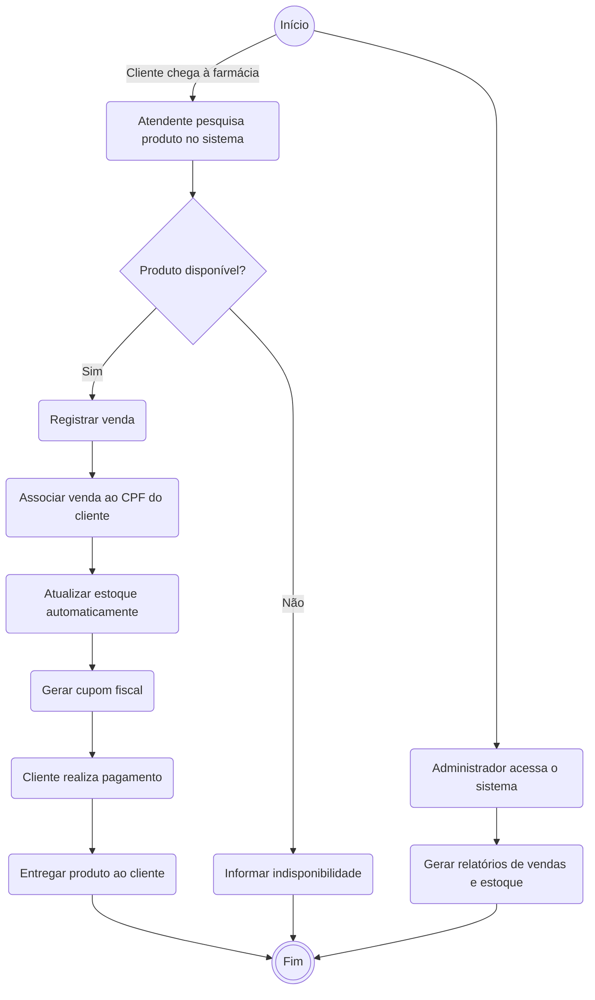

<h2><a href= "https://www.mackenzie.br">Universidade Presbiteriana Mackenzie</a></h2>
<h3><a href= "https://www.mackenzie.br/graduacao/sao-paulo-higienopolis/sistemas-de-informacao">Sistemas de Informação</a></h3>

# Sistema de Gestão para a Farmácia Vida Saudável

**Conteúdo**

- [Autores](#autores)
- [Descrição do Projeto](#descrição-do-projeto)
- [Análise de Requisitos](#análise-de-requisitos-funcionais-e-não-funcionais)
- [Diagrama de Atividades](#diagrama-de-atividades) 
- [Diagrama de Casos de Uso](#diagrama-de-comportamento-atores)
- [Descrição dos Casos de Uso](#descrição-das-funcões)
- [Diagrama de Senquencia](#diagrama-de-ordem-interações)
- [Diagrama de Classes](#diagrama-orientado-objetos)
- [Diagrama de Estados](#diagrama-estrutura-componente)
- [Diagrama de Implantação](#diagrama-de-hardware-software)
- [Referências](#referências)

# Autores

* Ana Clara
* Dayô Araujo
* Enzo Viana

# Descrição do Projeto
Objetivo: Desenvolver um sistema para modernizar a gestão da Farmácia Vida Saudável, automatizando o controle de vendas, estoque e clientes.

Principais Funcionalidades:

* Cadastro de medicamentos, produtos e clientes.
* Registro de vendas com atualização automática do estoque.
* Geração de relatórios gerenciais.
* Controle de acesso para atendentes e administradores.
* Fluxo Básico: O atendente consulta produtos, registra a venda e o estoque é atualizado. O administrador pode acessar relatórios.

Fases do Projeto:
* Análise de requisitos
* Modelagem UML (casos de uso, atividades, classes, sequência e implantação).

# Análise de Requisitos Funcionais e Não-Funcionais

| ID | RF | DESCRIÇÃO |
|-----|----|----------|
|RF-01| Cadastro | Permitir o cadastro, edição de dados e exclusão de clientes, incluindo dados pessoais (CPF, Nome, Endereço e Telefone).|
|RF-02| Cadastro | Permitir o cadastro, edição de dados e exclusão de produtos e medicamentos, incluindo dados (Nome, Código, Descrição, Lote, Data de Validade, Quantidade de Estoque).|
|RF-03| Venda | Possibilitar a realização de vendas, associar o cliente e os produtos comprados, gerar um recibo digital/físico.|
|RF-04| Venda | Calcular automaticamente o total da compra e aplicar descontos, se houver. |
|RF-05| Consulta | Consultar o histórico de compras do cliente.|
|RF-06| Consulta | Consultar a disponibilidade de produtos por código ou nome.|
|RF-07| Estoque | O sistema deve enviar um alerta se houver produtos próximos da validade.|
|RF-08| Estoque | Gerenciamento de estoque, mostrar a quantidade de produtos em estoque.|
|RF-09| Relatório | Gerar relatório de vendas diárias, semanais e mensais.|
|RF-10| Relatório | Gerar relatório de medicamentos e produtos disponíveis.|
|RF-11| Pagamento | Integrar-se a um sistema de pagamento para processar cartões de crédito e débito.|

| ID | RNF | DESCRIÇÃO |
|-------|-------|-------|
|RNF-01|Disponibilidade|O sistema deve possuir uma alta Disponibilidade.|
|RNF-02|Acessibilidade|O sistema deve ser acessível para o maximo de dispositivos possiveis.|
|RNF-03|Desempenho|O tempo de resposta da consulta e respota do sitema deve ser ágil.|
|RNF-04|Segurança e Conformidade|Os dados dos clientes e das transações devem sert armazenados de forma segura, garantindo conformidade com a LGPD(Lei Geral de Poteção de Dados).|
|RNF-05|Segurança|O sistema deve exigir autenticação dos funcionários para acesso ás funções administrativas.|
|RNV-06|Segurança|O banco de daos deve ser preotegido com criptografia para evitar acessos não autorizados.|
|RNF-07|Escalabilidade|O sistema deve suportar até 500 usuários simultâneos sem degradação no desempenho.|
|RNF-08|Backup|O sitema deve realizar backups automáticos diariamente.|
|RNF-09|Usabilidade|A interface do usário deve ser intuitiva e responsiva, adaptando-se a diferentes dispositivos.|
|RNF-10|Auditoria de Log|O sistema deve permitir auditoria de todas as transações realizadas. Os logs devem ser armazenados por no minímo 05 anos e protegidos contra alteração ou exclusão.|

# Diagrama de Atividades

# Diagrama de Casos de Uso

*&lt;Diagrama para visualizar o comportamento dos atores&gt;*

# Descrição dos Casos de Uso

*&lt;Descrição do comportamento entre os atores/resquisitos&gt;*

# Diagrama de Sequência

*&lt;Diagrama de ordem e interação dos objetos&gt;*

# Diagrama de Classes

*&lt;Diagrama de relacionamento entre classes para os seus atributos e operações&gt;*

# Diagrama de Estados

*&lt;Diagrama para permite modelar o comportamento interno de um determinado objeto, subsistema ou sistema global&gt;*

# Diagrama de Implantação

*&lt;Diagrama para exibir o relacionamento de hardware e software no projeto&gt;*

# Referências

*&lt;Lista de referências&gt;*
