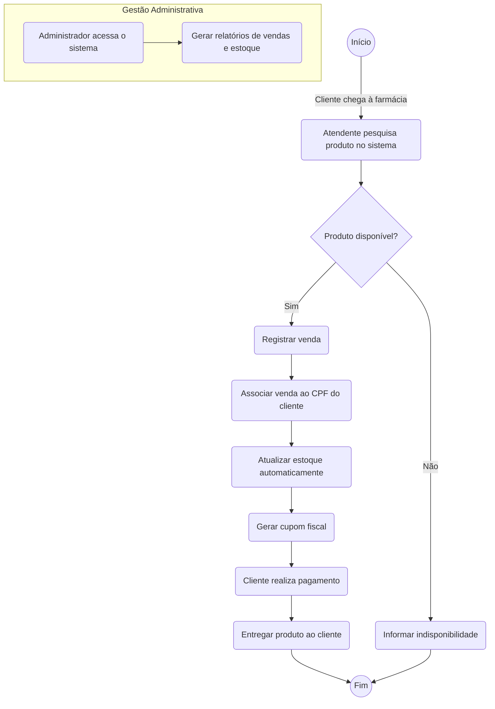

<h2><a href= "https://www.mackenzie.br">Universidade Presbiteriana Mackenzie</a></h2>
<h3><a href= "https://www.mackenzie.br/graduacao/sao-paulo-higienopolis/sistemas-de-informacao">Sistemas de Informação</a></h3>

# Sistema de Gestão para a Farmácia Vida Saudável

**Conteúdo**

- [Autores](#autores)
- [Descrição do Projeto](#descrição-do-projeto)
- [Análise de Requisitos](#análise-de-requisitos-funcionais-e-não-funcionais)
- [Diagrama de Atividades](#diagrama-de-atividades) 
- [Diagrama de Casos de Uso](#diagrama-de-comportamento-atores)
- [Descrição dos Casos de Uso](#descrição-das-funcões)
- [Diagrama de Senquencia](#diagrama-de-ordem-interações)
- [Diagrama de Classes](#diagrama-orientado-objetos)
- [Diagrama de Estados](#diagrama-estrutura-componente)
- [Diagrama de Implantação](#diagrama-de-hardware-software)
- [Referências](#referências)

# Autores

* Ana Clara
* Dayô Araujo
* Enzo Viana

# Descrição do Projeto
A Farmácia Vida Saudável tem crescido e, com isso, surgiu a necessidade de melhorar a organização do dia a dia. Hoje, tudo é feito manualmente, com anotações em cadernos e planilhas, o que pode causar erros e atrasos no atendimento.

Para resolver esse problema, o Sr. Boticário decidiu modernizar a farmácia com um sistema informatizado. Com a ajuda da MACK Solutions SW, esse sistema vai facilitar o controle de vendas, estoque e clientes, tornando o trabalho mais ágil e eficiente para todos.

# Análise de Requisitos Funcionais e Não-Funcionais
|Requisitos Funcionais|Requisitos Não Funcionais|
|---------------------|---------------------|
|Cadastro de Medicamentos e Produtos|Usabilidade|
|Cadastro de Clientes|Desempenho|
|Processo de Venda|Segurança|
|Controle de Estoque|Escalabilidade|
|Relatórios Gerenciais|Confiabilidade|
||Compatibilidade|

# Diagrama de Atividades

# Diagrama de Casos de Uso

*&lt;Diagrama para visualizar o comportamento dos atores&gt;*

# Descrição dos Casos de Uso

*&lt;Descrição do comportamento entre os atores/resquisitos&gt;*

# Diagrama de Sequência

*&lt;Diagrama de ordem e interação dos objetos&gt;*

# Diagrama de Classes

*&lt;Diagrama de relacionamento entre classes para os seus atributos e operações&gt;*

# Diagrama de Estados

*&lt;Diagrama para permite modelar o comportamento interno de um determinado objeto, subsistema ou sistema global&gt;*

# Diagrama de Implantação

*&lt;Diagrama para exibir o relacionamento de hardware e software no projeto&gt;*

# Referências

*&lt;Lista de referências&gt;*
